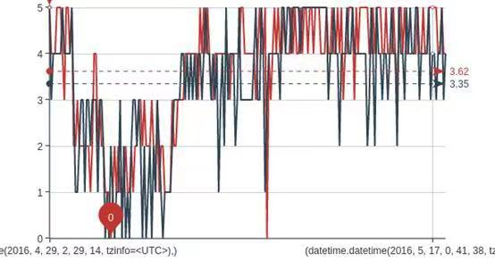
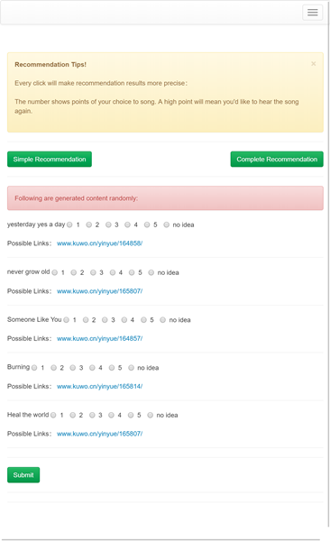
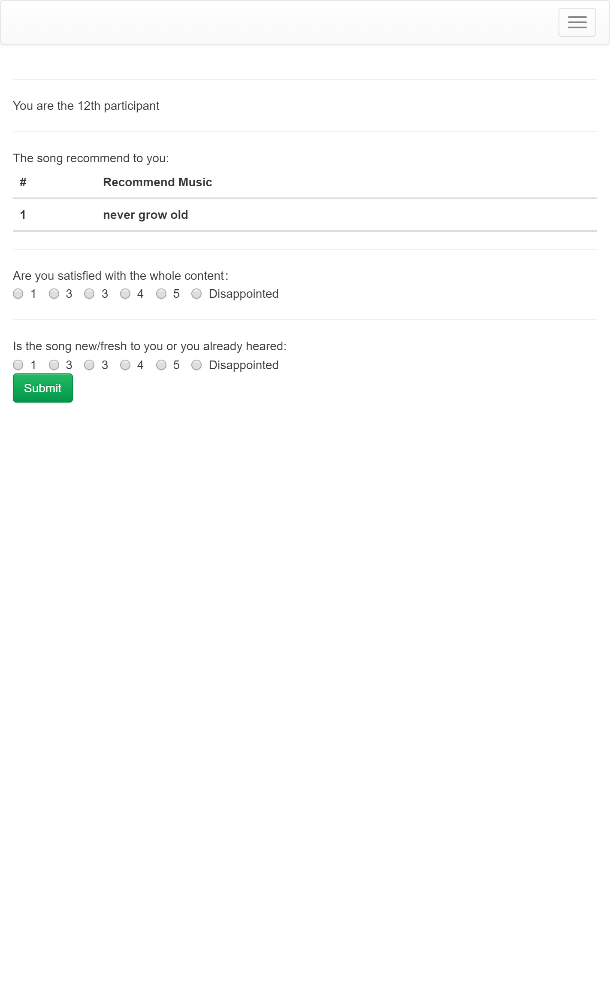

#### What is it ?

* This is a `recommendation system` based on Django

* Mainly there are 3 algorithms uses:

a. `UserCF`(User-based Collaborative Flitering)

b. `ItemCF`(Item-based Collaborative Filtering)

c. `LFM`(Latent Factor Model)

This project mainly uses `ItemCF` as the recommend algorithm.

#### Project

Following the traditional MVC(Model/View/Control) architecture

#### Data Visualization

Google's highcharts library

The recommend principle is **If more people like item A and item B at the same time, then item A and item B have obvious similarities.**

In short, the basic similarity is calculated by a complex formula. You can the the implementation of codes in [here](recommend/recommend/views.py#L216)

---

##### 对数据的抓取

推荐系统中一个非常重要的部分就是 冷启动(cold start),从无到有构造一个推荐的数据积累

利用 requests+PhamtomJs+Selenium 构建了一个多线程爬虫，爬取了百度音乐、酷狗音乐、酷我音乐(网易云音乐用 API 直接读取 json 格式数据后进行处理)上5W+个专辑， 经过 数据清洗(去掉已经是死链的 url 和 歌曲数量少于5条的专辑)后，拿到了总共 47222 个共 637404条 的数据量。

每条数据量包括 UserID,music,url,rating.有些部分的 url 无法抓取，用 None 来代替。 还有同一首歌在不同的网站上会有不同的名称，加上了诸如 [国语、歌手名、演唱时间] 等无关因素，但对最终结果的影响不大。 其中的 rating 我是以 评论数量 来作为判断依据的。以网易云音乐为例

0-500 是1分
500-1000是2分
1000-2000是3分
2000-3000是4分
而大于3000条以上的说明是最热门，打5分。
之后利用 Hadoop 的 streaming 工具 来对数据进行处理，建立 mapper 和 reducer 函数， 将 url 用 b64encode 进行编码，进行统一的定位，形成如 [47211 U2VtcHJlbOKAmGlzdGVzc29UZW1wbw== None 3] 这样的格式， 方便在数据库和 Django 的后端中进行处理。

在这里还需要说明的一点是一开始我还考虑到了利用 Hadoop 的 mahout 工具来做推荐， 但最后查看文档发现 mahout 库并不适合在单机上进行推荐运算，而用分布式配置的话数据量又远远不够。 所以最后还是自己用 Python 来实现算法，一方面能方便修改各种参数，另一方面能加深自己对算法的理解。

---

##### 实际工程的构建

> 一个好的产品是考虑人性的
自己本意想要实现的是一个问答社区和论坛的综合体，来承载推荐算法。

自己后端采用 Django，前端用 Bootstrap。在实现的过程中 遵循了 《Two scopes of Django:The Best Practice》的最佳实践指南，使用 form 而非 request.POST 的方式来处理前后端交互， 做到了标准的 MVC 架构，同时避免 Django-bootstrap3 或者 crispy_forms 这样的表单展示插件， 后端传送给前端纯粹的 json 数据，使 逻辑和展示 分离开来。在开发的过程中则根 据 《Test Driven Development:Python Web》的建议方式，在 authen 模块里用 TDD 的方式进行开发，编写了足够多的测试用例来保证程序的健壮性。

出于对测试数据的积累和用户数据量的考虑，我没有用 @login_required 必须要求登陆 才能参与推荐，而是对任意参与的用户都进行推荐。

1. 只对用户进行简单的推荐。我会从歌曲中随机抽出10首歌，来让用户进行打分。1-5星对应1-5分，而如果用户选择了不感兴趣，那么 该项就不会计入到最终的推荐结果中

在用户选择了不同的推荐方式之后，系统就会依据用户对不同歌曲的喜好来进行推荐。同时允许用户对此次的推荐结果进行打分。

推荐系统有许多的测试指标，包括在第一部分测试 ItemCF 中所采用的 准确率(precision)、召回率(recall)和覆盖率(coverage) 等三个指标。 但考虑到最终要面向用户，所以我选择了 满意度(satisfy_rate) 和 新鲜度(fresh_rate) 两个指标。完全由用户在结果完成后进行评价，之后再进行有针对性的评价。

同时为了能够合理地展示最后的结果，将单纯的数字量化为具体分析的指标，我选择用 Echarts 作为数据可视化的工具。
首先是对满意度和新鲜度选择折线图作为展示工具，可以表现出随着测试数据量的增大，指标的变化情况。 同时还以平均数作为基准线，能够更明了地看出变化情况。Echarts 本身还有将折线图区域放大的功能和转换为柱状图展示的功能， 能够适应不同维度的需求。 

recommend_4.png

其次还有对推荐满意度和新鲜满意度的 饼形图展示，对于所有满意度<2 的比例，都认为是不达标的，和打分为 3,4,5 的作为因素来进行绘图。可以直接看出推荐效果的好坏(和时间的关系不大,而是将整体的打分标准都计入考虑) 最后是访问来源的绘图。通过类似 custom-pies 这样的图片，可以比饼形图更形象展示用户来源。

Deploy :
Nginx+Gunicorn+Supervisor 